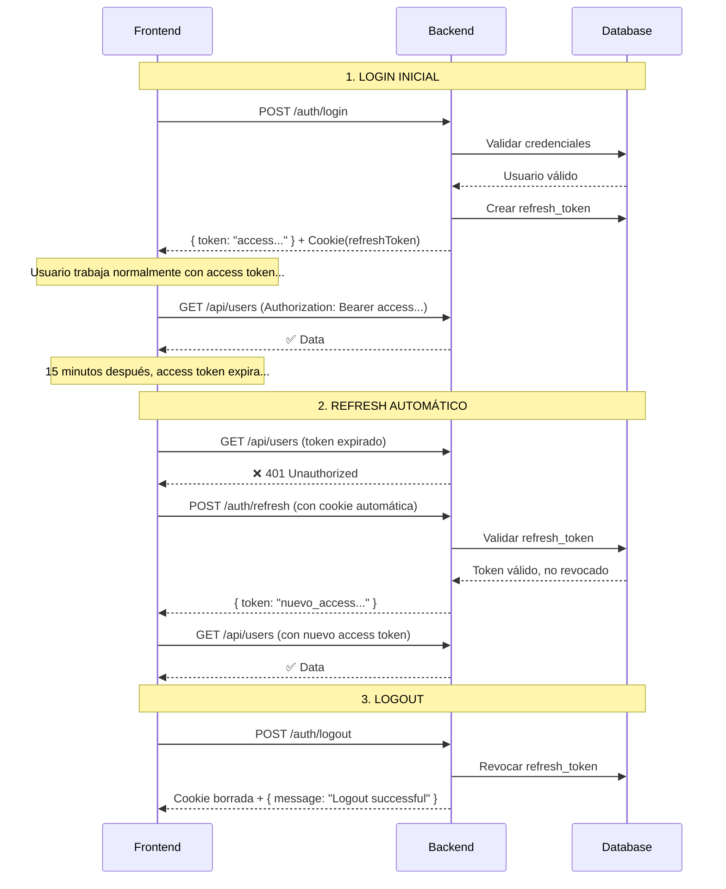

# 🚀 NestJS RBAC Dynamic - Sistema de Control de Acceso Basado en Roles

Sistema backend robusto desarrollado con **NestJS**, **TypeORM** y **MariaDB**, implementando un sistema completo de **RBAC (Role-Based Access Control)** con permisos dinámicos, autenticación JWT, validaciones personalizadas y logging avanzado con Winston.

## 📋 Tabla de Contenidos

- [Características Principales](#-características-principales)
- [Stack Tecnológico](#-stack-tecnológico)
- [Arquitectura del Sistema](#-arquitectura-del-sistema)
- [Instalación y Configuración](#-instalación-y-configuración)
- [Módulos Implementados](#-módulos-implementados)
- [Sistema RBAC](#-sistema-rbac-role-based-access-control)
- [API Endpoints](#-api-endpoints)
- [Validaciones Personalizadas](#-validaciones-personalizadas)
- [Logging](#-logging-con-winston)
- [Testing](#-testing)
- [Documentación Adicional](#-documentación-adicional)

---

## ✨ Características Principales

### 🔐 Seguridad y Autenticación
- ✅ **Dual Token Strategy**: Access Token (15min) + Refresh Token (30d)
- ✅ Autenticación JWT con Passport
- ✅ Sistema RBAC (Roles y Permisos) dinámico
- ✅ Decorador `@Auth()` flexible (roles, permisos o ambos)
- ✅ Guards personalizados para protección de rutas
- ✅ Hash de contraseñas con bcrypt
- ✅ Validación de contraseñas fuertes
- ✅ Refresh Tokens en httpOnly cookies (protección contra XSS)
- ✅ Revocación de tokens y tracking de dispositivos

### 🎯 Sistema de Permisos
- ✅ Auto-detección de permisos desde el código
- ✅ Sincronización automática en desarrollo
- ✅ CRUD completo de roles y permisos
- ✅ Asignación dinámica de permisos a roles
- ✅ Soft delete para roles y permisos

### 🛠️ Funcionalidades Avanzadas
- ✅ Validadores personalizados con inyección de dependencias
- ✅ Logging estructurado con Winston (archivos rotativos)
- ✅ Sistema de seeds con protección para producción
- ✅ Documentación Swagger automática
- ✅ Gestión de archivos con validación
- ✅ Paginación configurable

### 🏗️ Arquitectura
- ✅ Modular y escalable siguiendo principios SOLID
- ✅ Inyección de dependencias
- ✅ Separación de responsabilidades
- ✅ DTOs con validación exhaustiva
- ✅ Exception handling centralizado

---

## 🛠️ Stack Tecnológico

### Core
- **Framework**: NestJS 11.0.1
- **Runtime**: Node.js (v18+)
- **Package Manager**: Yarn
- **Base de Datos**: MariaDB 10.11
- **ORM**: TypeORM 0.3.28

### Librerías Principales
```json
{
  "@nestjs/jwt": "^11.0.0",
  "@nestjs/passport": "^10.0.3",
  "@nestjs/swagger": "^8.0.8",
  "@nestjs/typeorm": "^11.0.5",
  "bcrypt": "^5.1.1",
  "class-validator": "^0.14.1",
  "class-transformer": "^0.5.1",
  "passport-jwt": "^4.0.1",
  "winston": "^3.19.0",
  "nest-winston": "^1.10.2",
  "winston-daily-rotate-file": "^5.0.0"
}
```

---

## 🏗️ Arquitectura del Sistema

```
src/
├── access-control/          # CRUD de roles y permisos
│   ├── entities/            # Role, Permission
│   ├── dto/                 # DTOs de roles y permisos
│   ├── access-control.service.ts
│   ├── access-control.controller.ts
│   └── permissions-scanner.service.ts  # Auto-detección
│
├── auth/                    # Autenticación y autorización
│   ├── decorators/          # @Auth(), @GetUser(), etc.
│   ├── guards/              # RolesPermissionsGuard
│   ├── strategies/          # JwtStrategy
│   ├── dto/                 # CreateUser, Login, etc.
│   └── entities/            # User
│
├── common/                  # Módulos compartidos
│   ├── validators/          # @Exists, @IsUnique, @IsStrongPassword
│   ├── adapters/            # Bcrypt, Axios
│   ├── dto/                 # PaginationDto
│   └── exceptions/          # Exception handling
│
├── config/                  # Configuraciones
│   ├── envs.ts             # Variables de entorno
│   ├── datasource.ts       # TypeORM DataSource
│   └── winston.config.ts   # Winston logger
│
├── product/                # Gestión de productos
├── category/               # Gestión de categorías
├── files/                  # Gestión de archivos
└── seed/                   # Seeds con protección
```

---

## 🚀 Instalación y Configuración

### 1️⃣ Requisitos Previos

- **Node.js**: v18 o superior
- **Yarn**: Instalado globalmente
- **Docker Desktop**: Para MariaDB (opcional)
- **Git**: Para clonar el repositorio

### 2️⃣ Clonar el Repositorio

```bash
git clone https://github.com/tu-usuario/nestjs-rbac-dynamic.git
cd nestjs-rbac-dynamic
```

### 3️⃣ Instalar Dependencias

```bash
yarn install
```

### 4️⃣ Configurar Base de Datos

#### Opción A: Con Docker (Recomendado)

```bash
# Levantar MariaDB con Docker Compose
docker-compose up -d

# Verificar que esté corriendo
docker ps
```

#### Opción B: MariaDB Local

1. Instalar MariaDB 10.11+
2. Crear la base de datos:
```sql
CREATE DATABASE nest_rbac_dynamic CHARACTER SET utf8mb4 COLLATE utf8mb4_unicode_ci;
```

### 5️⃣ Configurar Variables de Entorno

Copiar el archivo de ejemplo y configurar:

```bash
cp .env.template .env
```

Editar `.env`:

```bash
# Entorno y Puerto
NODE_ENV=development
PORT=3000
# CORS permitidos (separados por comas para múltiples), soporta único o comodín *
ORIGIN=http://localhost:3000,http://localhost:5173,http://localhost:4200
# JWT Secrets y Expiraciones
JWT_ACCESS_SECRET=your-super-secret-access-key-change-this-in-production-min-32-chars
JWT_REFRESH_SECRET=your-super-secret-refresh-key-change-this-in-production-min-32-chars
JWT_ACCESS_TOKEN_EXPIRATION=15M
JWT_REFRESH_TOKEN_EXPIRATION=30D

# Base de Datos
DB_USERNAME=
DB_PASSWORD=
DB_NAME=
DB_HOST=
DB_PORT=
# Habilitar sincronización automática de esquema (solo para desarrollo)
DB_SYNCHRONIZE=true

# Rol por defecto asignado a nuevos usuarios
DEFAULT_USER_ROLE=viewer
# Habilitar sincronización automática de permisos desde decoradores en el código
PERMISSIONS_AUTO_SYNC=true

# Auto-asignación de permisos (JSON format)
# El scanner detecta permisos del código y los asigna automáticamente según estos patrones
# Formato: {"role-slug": ["pattern1", "pattern2"], ...}
#
# Patrones soportados:
#   "*"           → Todos los permisos (solo para super-admin)
#   "users.*"     → Todos los permisos de users (users.read, users.create, users.update, users.delete, etc.)
#   "*.read"      → Todos los permisos .read de cualquier recurso
#   "users.read"  → Permiso específico exacto
#
# Los permisos se crean automáticamente al escanear decoradores @Auth() en el código
# Luego se asignan a roles que coincidan con estos patrones
#
AUTO_ASSIGN_PERMISSIONS_RULES={"super-admin":["*"],"admin":["*.read","*.create","*.update"],"editor":["*.read","*.update"],"viewer":["*.read"]}
```

### 6️⃣ Ejecutar la Aplicación

#### Desarrollo
```bash
# Con auto-reload
yarn start:dev

# Ver logs detallados
yarn start:dev --debug
```

#### Producción
```bash
# Build
yarn build

# Ejecutar
yarn start:prod
```

### 7️⃣ Ejecutar Seed Inicial

**⚠️ IMPORTANTE**: El seed solo se puede ejecutar **UNA VEZ en producción** para prevenir duplicados.

```bash
# Opción 1: Desde la API
curl -X POST http://localhost:3000/api/seed/run

# Opción 2: Desde el navegador
POST http://localhost:3000/api/seed/run
```

El seed crea:
- ✅ Roles básicos: `admin`, `user`, `super-admin`
- ✅ Permisos por módulo: `users.*`, `roles.*`, `permissions.*`
- ✅ Usuario administrador por defecto
- ✅ Datos de ejemplo (productos, categorías)

---

## 📦 Módulos Implementados

### 1. 🔐 Auth Module

**Responsabilidad**: Autenticación JWT y gestión de usuarios.

**Endpoints Principales**:
```bash
POST   /auth/register         # Registro de usuario
POST   /auth/login            # Login (retorna access + refresh token en cookie)
POST   /auth/refresh          # Refrescar access token (usa cookie automática)
POST   /auth/logout           # Logout y revocar refresh token
GET    /auth/verify           # Verificar access token actual
```

**Características**:
- **Dual Token Strategy** para mayor seguridad:
  - **Access Token**: JWT de corta duración (15 min) en header Authorization
  - **Refresh Token**: JWT de larga duración (30 días) en httpOnly cookie
- Autenticación JWT con Passport (dos estrategias: jwt y jwt-refresh)
- Hash de contraseñas con bcrypt
- Asignación de rol por defecto configurable
- Asignación de múltiples roles al registrar
- Tracking de dispositivos (IP + User-Agent)
- Revocación de tokens en base de datos
- Protección contra XSS (refresh token inaccesible desde JavaScript)
- Validaciones personalizadas de contraseñas fuertes

**Ejemplo de Registro**:
```json
POST /auth/register
{
  "username": "johndoe",
  "email": "john@example.com",
  "password": "SecurePass123!",
  "role_ids": [1, 2]  // Opcional
}
```

### 2. 🎯 Access Control Module

**Responsabilidad**: CRUD de roles, asignación de permisos, visualización de permisos.

**Endpoints Principales**:
```
# ROLES
POST   /access-control/roles                  # Crear rol
GET    /access-control/roles                  # Listar roles
GET    /access-control/roles/:id              # Ver rol
PATCH  /access-control/roles/:id              # Actualizar rol
DELETE /access-control/roles/:id              # Eliminar rol

# PERMISOS A ROLES
POST   /access-control/roles/:id/permissions        # Asignar (reemplaza)
PATCH  /access-control/roles/:id/permissions/add    # Agregar
PATCH  /access-control/roles/:id/permissions/remove # Remover

# PERMISOS
GET    /access-control/permissions            # Listar permisos
GET    /access-control/permissions/:id        # Ver permiso
POST   /access-control/permissions/sync       # Sincronizar permisos (admin)
```

**Protección**: Requiere roles `admin` o `super-admin` + permisos específicos.

### 3. 🔍 Permissions Scanner Service

**Responsabilidad**: Auto-detección de permisos desde el código.

**Funcionamiento**:
1. Escanea todos los controladores al iniciar la app
2. Detecta decoradores `@Auth()` y `@RequirePermissions()`
3. Crea automáticamente permisos nuevos en la BD
4. Genera descripciones automáticas

**Configuración**:
- **Desarrollo**: Auto-sync habilitado por defecto
- **Producción**: Auto-sync deshabilitado (usar endpoint manual)

**Ejemplo**:
```typescript
@Controller('posts')
export class PostsController {
  @Post()
  @Auth({ permissions: ['posts.create'] })  // 👈 Se detecta automáticamente
  create() { }
}
```

### 4. 📝 Product Module

**Endpoints**:
```
POST   /products              # Crear producto
GET    /products              # Listar productos (paginado)
GET    /products/:id          # Ver producto
PATCH  /products/:id          # Actualizar producto
DELETE /products/:id          # Eliminar producto
```

### 5. 🏷️ Category Module

**Endpoints**:
```
POST   /categories            # Crear categoría
GET    /categories            # Listar categorías
GET    /categories/:id        # Ver categoría
PATCH  /categories/:id        # Actualizar categoría
DELETE /categories/:id        # Eliminar categoría
```

### 6. 📁 Files Module

**Endpoints**:
```
POST   /files/upload          # Subir archivo
GET    /files/:filename       # Descargar archivo
```

**Características**:
- Validación de tipos de archivo
- Límite de tamaño configurable
- Almacenamiento en `/static/uploads`

### 7. 🌱 Seed Module

**Endpoint**:
```
POST   /seed/run                  # Ejecutar seed
```

**Protección**:
- Solo se ejecuta **UNA VEZ** en producción
- Crea estructura completa de roles, permisos y usuarios
- Registra ejecución en tabla `seed_executions`

---

## 🔒 Sistema RBAC (Role-Based Access Control)

### Arquitectura

```
Usuario (User)
    ↓ many-to-many
Rol (Role)
    ↓ many-to-many
Permiso (Permission)
```

### Decorador @Auth() Flexible

El decorador `@Auth()` es el corazón del sistema de autorización:

#### 1. Solo Autenticación
```typescript
@Get('profile')
@Auth()  // ✅ Solo verifica JWT
getProfile() { }
```

#### 2. Solo Permisos
```typescript
@Post('users')
@Auth({ permissions: ['users.create'] })  // ✅ Debe tener TODOS los permisos
createUser() { }
```

#### 3. Solo Roles
```typescript
@Get('admin/dashboard')
@Auth({ roles: ['admin', 'super-admin'] })  // ✅ Debe tener AL MENOS UN rol
getDashboard() { }
```

#### 4. Roles Y Permisos (Ambos)
```typescript
@Delete('users/:id')
@Auth({ 
  roles: ['admin'], 
  permissions: ['users.delete'] 
})  // ✅ Debe cumplir AMBAS condiciones
deleteUser() { }
```

### Lógica de Validación

| Configuración | Roles | Permisos | Resultado |
|--------------|-------|----------|-----------|
| `@Auth()` | ❌ | ❌ | Solo JWT |
| `@Auth({ permissions: ['x'] })` | ❌ | ✅ Todos | Requiere todos los permisos |
| `@Auth({ roles: ['x', 'y'] })` | ✅ Al menos uno | ❌ | Requiere al menos un rol |
| `@Auth({ roles: ['x'], permissions: ['y'] })` | ✅ Al menos uno | ✅ Todos | Requiere ambas condiciones |

---

## 🔐 Dual Token Strategy (Access + Refresh Tokens)

### ¿Por qué Dual Token?

La estrategia tradicional de un solo JWT tiene vulnerabilidades:
- ❌ **Token de larga duración**: Si se compromete, es válido por horas
- ❌ **Sin revocación**: No se puede invalidar hasta que expire
- ❌ **XSS vulnerable**: localStorage es accesible por JavaScript malicioso

**Dual Token Strategy resuelve estos problemas:**
- ✅ **Access Token corto** (15 min): Reducción drástica de ventana de ataque
- ✅ **Refresh Token largo** (30 días): En httpOnly cookie, inaccesible desde JS
- ✅ **Revocación inmediata**: Tokens se pueden invalidar en base de datos
- ✅ **Tracking de dispositivos**: IP y User-Agent registrados

### Arquitectura de Tokens

```
┌─────────────────────────────────────────────────────────┐
│ FRONTEND                                                 │
│                                                          │
│ localStorage (accesible desde JavaScript):              │
│  📄 accessToken: "eyJhbGc..." (15 minutos)              │
│     └─ Se envía en header: Authorization: Bearer ...   │
│                                                          │
│ httpOnly Cookie (NO accesible desde JavaScript):        │
│  🍪 refreshToken: "eyJhbGc..." (30 días)                │
│     └─ Se envía automáticamente en requests             │
│     └─ Protegido: httpOnly, secure, sameSite=strict    │
└─────────────────────────────────────────────────────────┘
```

### Flujo de Autenticación



### Endpoints del Sistema

#### 1. Login/Register (Generan ambos tokens)

```http
POST /api/auth/login
Content-Type: application/json

{
  "username": "johndoe",
  "password": "SecurePass123!"
}
```

**Response:**
```json
{
  "id": "1",
  "username": "johndoe",
  "email": "john@example.com",
  "token": "eyJhbGciOiJIUzI1NiIsInR5cCI6IkpXVCJ9..."  ← Access Token
}
```

**+ Cookie automática:**
```
Set-Cookie: refreshToken=eyJhbGc...; HttpOnly; Secure; SameSite=Strict; Path=/; Max-Age=2592000
```

#### 2. Refresh Access Token

```http
POST /api/auth/refresh
(No requiere body, la cookie se envía automáticamente)
```

**Response:**
```json
{
  "token": "eyJhbGciOiJIUzI1NiIsInR5cCI6IkpXVCJ9..."  ← Nuevo Access Token
}
```

#### 3. Logout (Revoca refresh token)

```http
POST /api/auth/logout
(Cookie se envía automáticamente)
```

**Response:**
```json
{
  "message": "Logout successful"
}
```

**+ Cookie borrada:**
```
Set-Cookie: refreshToken=; HttpOnly; Path=/; Max-Age=0
```

### Testing con Postman

#### Configuración Inicial
1. **Habilitar cookies**: Settings → General → "Automatically follow redirects" ✅
2. **Dominio local**: Postman maneja cookies automáticamente para localhost

#### Flujo de Testing

**Paso 1: Login**
```
POST http://localhost:3000/api/auth/login
Body: { "username": "admin", "password": "Admin123!" }

✅ Guardar el access token retornado
✅ Postman guarda la cookie refreshToken automáticamente
```

**Paso 2: Usar API con Access Token**
```
GET http://localhost:3000/api/auth/users/list
Headers: Authorization: Bearer {access_token}

✅ Funciona normalmente
```

**Paso 3: Simular Token Expirado (después de 15 min)**
```
POST http://localhost:3000/api/auth/refresh
(Sin headers, sin body - la cookie se envía sola)

✅ Obtienes nuevo access token
✅ Actualizar en variables de Postman
```

**Paso 4: Logout**
```
POST http://localhost:3000/api/auth/logout

✅ Refresh token revocado
✅ Cookie borrada
```

### Integración Frontend

#### React/Vue/Angular

```typescript
// 1. Login - Guardar access token
async function login(username: string, password: string) {
  const response = await fetch('http://localhost:3000/api/auth/login', {
    method: 'POST',
    headers: { 'Content-Type': 'application/json' },
    credentials: 'include', // ← IMPORTANTE: Enviar/recibir cookies
    body: JSON.stringify({ username, password })
  });
  
  const data = await response.json();
  localStorage.setItem('accessToken', data.token); // ← Guardar access token
  // refreshToken se guarda automáticamente en cookie httpOnly
}

// 2. API Request con access token
async function fetchUsers() {
  const token = localStorage.getItem('accessToken');
  
  const response = await fetch('http://localhost:3000/api/users', {
    headers: { 
      'Authorization': `Bearer ${token}` 
    },
    credentials: 'include' // ← IMPORTANTE: Enviar cookies
  });
  
  if (response.status === 401) {
    // Token expirado, refrescar
    await refreshToken();
    return fetchUsers(); // Reintentar
  }
  
  return response.json();
}

// 3. Refresh automático
async function refreshToken() {
  const response = await fetch('http://localhost:3000/api/auth/refresh', {
    method: 'POST',
    credentials: 'include' // ← Cookie se envía automáticamente
  });
  
  if (response.ok) {
    const data = await response.json();
    localStorage.setItem('accessToken', data.token); // ← Nuevo token
  } else {
    // Refresh token inválido/expirado → redirect a login
    localStorage.removeItem('accessToken');
    window.location.href = '/login';
  }
}

// 4. Logout
async function logout() {
  await fetch('http://localhost:3000/api/auth/logout', {
    method: 'POST',
    credentials: 'include'
  });
  
  localStorage.removeItem('accessToken');
  window.location.href = '/login';
}
```

#### Axios Interceptor (Refresh Automático)

```typescript
import axios from 'axios';

const api = axios.create({
  baseURL: 'http://localhost:3000/api',
  withCredentials: true // ← Enviar cookies
});

// Agregar access token a cada request
api.interceptors.request.use((config) => {
  const token = localStorage.getItem('accessToken');
  if (token) {
    config.headers.Authorization = `Bearer ${token}`;
  }
  return config;
});

// Refresh automático en 401
api.interceptors.response.use(
  (response) => response,
  async (error) => {
    const originalRequest = error.config;
    
    if (error.response?.status === 401 && !originalRequest._retry) {
      originalRequest._retry = true;
      
      try {
        const { data } = await axios.post(
          'http://localhost:3000/api/auth/refresh',
          {},
          { withCredentials: true }
        );
        
        localStorage.setItem('accessToken', data.token);
        originalRequest.headers.Authorization = `Bearer ${data.token}`;
        
        return api(originalRequest); // Reintentar request original
      } catch (refreshError) {
        // Refresh falló → logout
        localStorage.removeItem('accessToken');
        window.location.href = '/login';
        return Promise.reject(refreshError);
      }
    }
    
    return Promise.reject(error);
  }
);

export default api;
```

### Tabla de Refresh Tokens

La tabla `refresh_tokens` almacena:

| Campo | Tipo | Descripción |
|-------|------|-------------|
| `id` | UUID | Identificador único |
| `token` | TEXT | JWT refresh token |
| `user_id` | INT | Relación con usuario |
| `expires_at` | TIMESTAMP | Fecha de expiración (30 días) |
| `is_revoked` | BOOLEAN | Si fue revocado manualmente |
| `ip_address` | VARCHAR(45) | IP del dispositivo |
| `user_agent` | TEXT | Navegador/dispositivo |
| `created_at` | TIMESTAMP | Fecha de creación |

**Usos avanzados:**
- Ver sesiones activas del usuario
- Revocar sesiones de dispositivos específicos
- Detectar actividad sospechosa (IPs inusuales)
- Limitar número de sesiones concurrentes

### Características de Seguridad

| Característica | Implementación | Beneficio |
|---------------|----------------|-----------|
| **HttpOnly Cookies** | ✅ `httpOnly: true` | Inaccesible desde JavaScript → Protección XSS |
| **Secure Flag** | ✅ `secure: true` (prod) | Solo se envía por HTTPS |
| **SameSite Strict** | ✅ `sameSite: 'strict'` | Protección contra CSRF |
| **Access Token Corto** | ✅ 15 minutos | Ventana de ataque reducida |
| **Revocación en BD** | ✅ Campo `is_revoked` | Logout inmediato posible |
| **Tracking Dispositivos** | ✅ IP + User-Agent | Auditoría y detección de anomalías |
| **CORS Configurado** | ✅ `credentials: true` | Permite cookies cross-origin seguras |

### Mejoras Opcionales

#### 1. Refresh Token Rotation
Rotar el refresh token cada vez que se usa (mayor seguridad):

```typescript
// En src/auth/auth.service.ts
async refreshAccessToken(...) {
  // Descomentar esta línea:
  await this.rotateRefreshToken(tokenId, currentUser, res, req);
}
```

#### 2. Cron Job para Limpiar Tokens Expirados

```typescript
import { Cron } from '@nestjs/schedule';

@Cron('0 0 * * *') // Cada día a medianoche
async cleanExpiredTokens() {
  await this.authService.cleanExpiredTokens();
}
```

#### 3. Dashboard de Sesiones Activas

```typescript
@Get('sessions')
@Auth()
async getUserSessions(@GetUser() user: User) {
  return this.authService.getUserActiveSessions(user.id);
}
```

---

## 🌐 API Endpoints

### Documentación Swagger

Una vez iniciada la aplicación, acceder a:

```
http://localhost:3000/api/docs
```

### Autenticación en Swagger

1. Hacer login: `POST /auth/login`
2. Copiar el access token retornado
3. Click en "Authorize" 🔓
4. Ingresar: `Bearer {ACCESS_TOKEN}`
5. Los refresh tokens se manejan automáticamente en cookies

### Tabla Completa de Endpoints

| Método | Endpoint | Autenticación | Roles | Permisos | Descripción |
|--------|----------|---------------|-------|----------|-------------|
| **AUTH** |
| POST | `/auth/register` | ❌ No | - | - | Registrar usuario nuevo |
| POST | `/auth/login` | ❌ No | - | - | Login (retorna access + refresh) |
| POST | `/auth/refresh` | 🍪 Cookie | - | - | Refrescar access token |
| POST | `/auth/logout` | 🍪 Cookie | - | - | Logout y revocar refresh token |
| GET | `/auth/verify` | 🔐 JWT | - | - | Verificar token actual |
| **ROLES** |
| POST | `/access-control/roles` | 🔐 JWT | admin, super-admin | roles.create | Crear rol |
| GET | `/access-control/roles` | 🔐 JWT | admin, super-admin | roles.read | Listar roles |
| GET | `/access-control/roles/:id` | 🔐 JWT | admin, super-admin | roles.read | Ver rol específico |
| PATCH | `/access-control/roles/:id` | 🔐 JWT | admin, super-admin | roles.update | Actualizar rol |
| DELETE | `/access-control/roles/:id` | 🔐 JWT | admin, super-admin | roles.delete | Eliminar rol |
| POST | `/access-control/roles/:id/permissions` | 🔐 JWT | admin, super-admin | roles.update | Asignar permisos (reemplaza) |
| PATCH | `/access-control/roles/:id/permissions/add` | 🔐 JWT | admin, super-admin | roles.update | Agregar permisos |
| PATCH | `/access-control/roles/:id/permissions/remove` | 🔐 JWT | admin, super-admin | roles.update | Remover permisos |
| **PERMISSIONS** |
| GET | `/access-control/permissions` | 🔐 JWT | admin, super-admin | permissions.read | Listar permisos |
| GET | `/access-control/permissions/:id` | 🔐 JWT | admin, super-admin | permissions.read | Ver permiso específico |
| POST | `/access-control/permissions/sync` | 🔐 JWT | super-admin | permissions.sync | Sincronizar permisos |
| **PRODUCTS** |
| POST | `/products` | 🔐 JWT | - | - | Crear producto |
| GET | `/products` | ❌ No | - | - | Listar productos (público) |
| GET | `/products/:id` | ❌ No | - | - | Ver producto (público) |
| PATCH | `/products/:id` | 🔐 JWT | - | - | Actualizar producto |
| DELETE | `/products/:id` | 🔐 JWT | - | - | Eliminar producto |
| **CATEGORIES** |
| POST | `/categories` | 🔐 JWT | - | - | Crear categoría |
| GET | `/categories` | ❌ No | - | - | Listar categorías (público) |
| GET | `/categories/:id` | ❌ No | - | - | Ver categoría (público) |
| PATCH | `/categories/:id` | 🔐 JWT | - | - | Actualizar categoría |
| DELETE | `/categories/:id` | 🔐 JWT | - | - | Eliminar categoría |
| **FILES** |
| POST | `/files/product` | 🔐 JWT | - | - | Subir imagen de producto |
| GET | `/files/product/:filename` | ❌ No | - | - | Descargar imagen |
| **SEED** |
| POST | `/seed/run` | ❌ No | - | - | Ejecutar seed (solo 1 vez en prod) |
| GET | `/seed/history` | 🔐 JWT | admin, super-admin | - | Ver historial de seeds |

**Leyenda:**
- 🔐 JWT: Requiere access token en header `Authorization: Bearer {token}`
- 🍪 Cookie: Requiere refresh token en cookie httpOnly (automático)
- ❌ No: Endpoint público, sin autenticación

---

## ✅ Validaciones Personalizadas

### @Exists - Validar existencia en BD

```typescript
import { Exists } from '@/common/validators';

export class CreatePostDto {
  @Exists(Category, 'id')
  category_id: number;  // ✅ Valida que la categoría exista
}
```

### @IsUnique - Validar unicidad

```typescript
import { IsUnique } from '@/common/validators';

export class CreateUserDto {
  @IsUnique(User, 'email')
  email: string;  // ✅ Valida que el email no exista
}

export class UpdateUserDto {
  @IsUnique(User, 'email', 'id')
  email: string;  // ✅ Excluye el ID actual en updates
}
```

### @IsStrongPassword - Validar contraseña fuerte

```typescript
import { IsStrongPassword } from '@/common/validators';

export class CreateUserDto {
  @IsStrongPassword()
  password: string;  // ✅ Requiere mayúsculas, minúsculas y números/especiales
}
```

---

## 📊 Logging con Winston

### Configuración

**Desarrollo**:
- Logs en consola con formato NestJS
- Nivel: `debug`

**Producción**:
- Logs en archivos rotativos:
  - `logs/application-%DATE%.log` (info+)
  - `logs/error-%DATE%.log` (solo errores)
- Retención: 14 días (application), 30 días (error)
- Nivel: `info`

### Uso en Servicios

```typescript
import { Logger } from '@nestjs/common';

@Injectable()
export class MyService {
  private readonly logger = new Logger(MyService.name);

  async doSomething() {
    this.logger.log('Operación iniciada');
    this.logger.debug('Datos:', data);
    this.logger.error('Error:', error.stack);
  }
}
```

---

## 🗃️ Migraciones de Base de Datos

### Configuración TypeORM

Este proyecto usa TypeORM con soporte para migraciones. Las migraciones se almacenan en `db/migrations/`.

### Scripts Disponibles

```bash
# Ver estado de migraciones
yarn migration:show

# Generar migración automáticamente (detecta cambios)
yarn migration:generate db/migrations/NombreMigracion

# Crear migración vacía (manual)
yarn migration:create db/migrations/NombreMigracion

# Ejecutar migraciones pendientes
yarn migration:run

# Revertir última migración
yarn migration:revert
```

### Generar Migración Inicial

Si estás empezando y tienes `DB_SYNCHRONIZE=true`:

```bash
# 1. Cambiar a false en .env
DB_SYNCHRONIZE=false

# 2. Generar migración inicial
yarn migration:generate db/migrations/InitialSchema

# 3. Ejecutar migración
yarn migration:run

# 4. Ejecutar seed
curl -X POST http://localhost:3000/api/seed/run
```

### Workflow de Desarrollo

#### Desarrollo Local
```bash
# .env
DB_SYNCHRONIZE=true  # TypeORM sincroniza automáticamente
```

#### Staging/Producción
```bash
# .env
DB_SYNCHRONIZE=false  # Usar migraciones

# Desplegar cambios
yarn build
yarn migration:run
yarn start:prod
```

### Ejemplo: Agregar Campo a Entidad

```typescript
// src/auth/entities/user.entity.ts
@Entity('users')
export class User {
  // ... campos existentes

  @Column({ default: true })
  is_active: boolean;  // 👈 Nuevo campo
}
```

### Mejores Prácticas

✅ **Hacer**:
- Usar migraciones en producción (`DB_SYNCHRONIZE=false`)
- Nombrar migraciones descriptivamente: `AddEmailToUser`, `CreateProductsTable`
- Revisar la migración generada antes de aplicarla
- Versionar migraciones en Git
- Probar migraciones en staging antes de producción

❌ **No Hacer**:
- Usar `DB_SYNCHRONIZE=true` en producción
- Editar migraciones ya aplicadas
- Eliminar migraciones del historial
- Ejecutar `migration:revert` en producción sin respaldo

---

## 🧪 Testing

```bash
# Tests unitarios
yarn test

# Tests e2e
yarn test:e2e

# Coverage
yarn test:cov
```
---

## 🤝 Contribuir

1. Fork el proyecto
2. Crear rama feature (`git checkout -b feature/amazing-feature`)
3. Commit cambios (`git commit -m 'Add amazing feature'`)
4. Push a la rama (`git push origin feature/amazing-feature`)
5. Abrir Pull Request

---

## 📄 Licencia

Este proyecto está bajo la licencia MIT.

---

## 👥 Autor

**Baubyte** - [GitHub](https://github.com/baubyte)

---

## 🙏 Agradecimientos

- NestJS Team
- TypeORM Team
- Comunidad Open Source